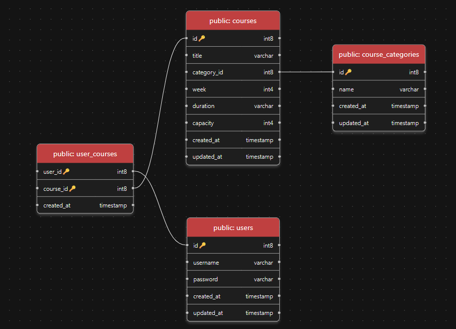

# chi + pg 選課系統

## 技術棧

- Web Framework
    - `chi`
- Database
    - `PostgreSQL`
    - `sqlc`
    - `goose`（migration）
- Cache
    - `Redis`（容量預檢）

## 待加入功能

- [x] Redis 容量預檢
- [ ] RabbitMQ 消息佇列

## 資料庫設計



---

## 選課架構

### 純 DB 路徑（FOR UPDATE）

所有選課請求直接進入 DB Transaction，透過 `SELECT ... FOR UPDATE` 取得行級鎖，確保資料一致性。流程如下：

```
請求 -> BEGIN TX -> SELECT course FOR UPDATE -> 檢查 capacity
     -> SELECT user FOR UPDATE -> 衝堂檢查 -> 扣減 capacity
     -> 寫入選課紀錄 -> 更新 user flag -> COMMIT
```

此架構下，每個請求無論最終成功或被拒，都需要進入 DB 排隊等鎖。

### 加上 Redis 預檢(4/18)

在進入 DB Transaction 之前，先用 Redis `HINCRBY` 原子扣減課程容量。若結果小於 0，代表名額已滿，直接拒絕請求，不碰 DB。

```
請求 -> Redis HINCRBY capacity -1
     -> 結果 < 0 ? -> 補回 Redis, 回傳「已滿」（不碰 DB）
     -> 結果 >= 0 ? -> 進入 DB Transaction（流程同上）
     -> DB 失敗時 -> Redis HINCRBY +1（補償回滾）
```

**核心原則：**

- DB 仍為 Source of Truth，Redis 僅做前置過濾
- Redis 異常時退化為純 DB 路徑，不影響正確性
- 補償機制確保 Redis 與 DB 容量一致

---

## 壓力測試結果

測試環境：Windows 本機，500 users / 50 courses / capacity=20  
工具：k6

### 測試場景說明

| 場景 | 描述 | 目的 |
|------|------|------|
| Hotspot | 100 人同時搶 1 門課（capacity=20） | 測試高鎖競爭下的延遲與正確性 |
| Spread | 200 人各選不同課 | 測試無競爭下的最大吞吐量 |
| Ramp-up | 0 -> 300 人漸增（60 秒） | 找出系統的效能極限 |

### Hotspot（100 人搶 1 門課）

| 指標 | 純 DB | + Redis 預檢 |
|------|-------|-------------|
| 成功選課 | 20 | 20 |
| 被拒絕 | 80 | 80 |
| Server Error | 0 | 0 |
| avg | 211 ms | 191 ms |
| p95 | 282 ms | 412 ms |

> Hotspot 場景中 p95 反而上升，原因是被 Redis 秒拒的 80 個請求延遲極低（<1ms），拉低了整體分布，使 p95 落在那 20 個進入 DB 排隊的請求上。實際上被拒請求的延遲從 ~280ms 降到了 <1ms。

### Spread（200 人選不同課）

| 指標 | 純 DB | + Redis 預檢 |
|------|-------|-------------|
| 成功選課 | 200 | 200 |
| Server Error | 0 | 0 |
| avg | 111 ms | 215 ms |
| p95 | 175 ms | 302 ms |
| req/s | 900 | 624 |

> Spread 場景延遲上升是預期行為。所有請求都成功，Redis 預檢沒有省掉任何 DB 操作，反而多了一次 Redis 網路來回。Redis 預檢僅在有大量被拒請求時才有價值。

### Ramp-up（0 -> 300 漸增壓力）

| 指標 | 純 DB | + Redis 預檢 | 變化 |
|------|-------|-------------|------|
| 成功選課 | 1,000 | 1,000 | -- |
| 總請求 | 25,280 | 31,315 | +24% |
| Server Error | 0 | 0 | -- |
| avg | 266 ms | 211 ms | -21% |
| p95 | 847 ms | 584 ms | **-31%** |
| max | 2,778 ms | 1,420 ms | **-49%** |
| req/s | 421 | 522 | **+24%** |

> Ramp-up 是 Redis 預檢真正發揮作用的場景。大量「已滿」請求在 Redis 層被攔截，釋放了 DB 連線與鎖資源，使系統在高負載下的延遲與吞吐量都有顯著改善。

### 結論

| 場景 | Redis 預檢效果 | 原因 |
|------|---------------|------|
| Hotspot | 數據上不明顯 | 被秒拒的請求延遲極低，但 p95 統計未反映 |
| Spread | 略微退步 | 無競爭場景下 Redis 只增加 RTT |
| Ramp-up | **顯著改善** | 大量被拒請求不再佔用 DB 資源 |

所有場景均為 **0 超賣、0 Server Error**，加入 Redis 預檢後資料一致性未受影響。
